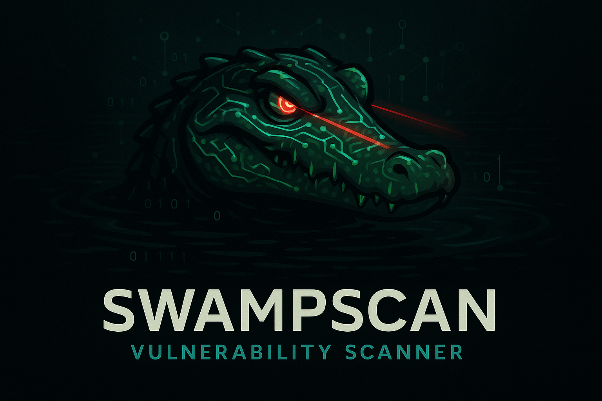

<div align="center">



# SwampScan
### Advanced Vulnerability Scanner

[](https://python.org)
[](https://opensource.org/licenses/MIT)
[](https://github.com/SourcePointSecurity/SwampScan/releases)
[](https://github.com/SourcePointSecurity/SwampScan/issues)
[](https://github.com/SourcePointSecurity/SwampScan/stargazers)

*Lurking in the depths of your network, hunting vulnerabilities with the stealth of a swamp predator*

[🚀 Quick Start](#-quick-start) • [📖 Documentation](#-documentation) • [🔧 Installation](#-installation) • [💡 Examples](#-examples) • [🛠️ Ubuntu Setup](#️-ubuntu-setup)

</div>

---

## 🐊 About SwampScan

SwampScan is a powerful Python command-line vulnerability scanner that provides comprehensive network security assessments using **signature-based detection**. Like a predator lurking in the digital swamp, SwampScan silently hunts for security vulnerabilities across your infrastructure with precision and stealth.

Built by security professionals for security professionals, SwampScan combines **lightweight signature-based scanning** with an intuitive command-line interface, automatic signature management, and flexible output formatting. **OpenVAS integration is optional** - SwampScan works out-of-the-box with downloaded vulnerability signatures. Whether you're conducting penetration tests, compliance audits, or routine security assessments, SwampScan adapts to your workflow.

### ✅ **Simple Installation - No OpenVAS Required**

SwampScan now features **signature-based scanning by default** - just install Python dependencies and download vulnerability signatures. **No complex OpenVAS setup required!** OpenVAS integration remains available as an optional advanced feature.

### 🎯 Key Features

**🔍 Signature-Based Scanning (Default)**
- ✅ **No OpenVAS Required** - Works with downloaded NASL signature files
- ✅ **Simple Installation** - Python dependencies only (5-minute setup)
- ✅ **Automatic Signature Management** - Download and update vulnerability signatures
- Support for single hosts, network ranges, and target files
- Flexible port specification with predefined service groups
- Real-time progress tracking and detailed logging

**🛡️ Optional OpenVAS Integration**
- ✅ **Ubuntu OpenVAS Integration** - Full compatibility when OpenVAS is desired
- ✅ **Enhanced Validation Logic** - Improved system detection and compatibility checking
- Use `--use-openvas` flag to enable full OpenVAS backend
- Automatic fallback to signature-based scanning

**📊 Flexible Output**
- CSV format for spreadsheet analysis
- Human-readable text reports for documentation
- JSON format for API integration and automation
- Customizable formatting options

**🛠️ Developer-Friendly**
- Python API for programmatic access
- Modular architecture for easy extension
- Comprehensive error handling and validation
- Extensive documentation and examples

**🚀 Enterprise-Ready**
- CI/CD pipeline integration
- Automated reporting capabilities
- Scalable architecture for large networks
- Security-focused design principles

---

## 🚀 Quick Start

Get SwampScan running with signature-based scanning in under 5 minutes:

```bash
# Clone the repository
git clone https://github.com/SourcePointSecurity/SwampScan.git
cd SwampScan

# Simple installation (signature-based scanning)
./scripts/install_swampscan_simple.sh

# Download vulnerability signatures
swampscan --download-signatures

# Run your first scan
swampscan scanme.nmap.org -p 22,80,443 -o results.json -f json
```

### 🎯 **Two Installation Options**

**Option 1: Simple Installation (Recommended)**
- ✅ **5-minute setup** - Python dependencies only
- ✅ **No OpenVAS required** - Signature-based scanning
- ✅ **Works everywhere** - Any system with Python 3.7+

**Option 2: Full Installation (Advanced)**
- ✅ **Complete OpenVAS integration** - Full vulnerability assessment
- ✅ **Enterprise features** - Advanced scanning capabilities
- ✅ **Ubuntu optimized** - Enhanced compatibility

### 📋 Quick Start Guide

**Simple Installation (Signature-Based)**
```bash
git clone https://github.com/SourcePointSecurity/SwampScan.git
cd SwampScan
./scripts/install_swampscan_simple.sh

# Download signatures and scan
swampscan --download-signatures --download-method samples
swampscan scanme.nmap.org -p web -o results.csv
```

**Full Installation (OpenVAS Integration)**
```bash
git clone https://github.com/SourcePointSecurity/SwampScan.git
cd SwampScan
./scripts/install_swampscan.sh

# Verify OpenVAS installation
swampscan --check-installation

# Use OpenVAS backend
swampscan scanme.nmap.org --use-openvas -p web -o results.csv
```

### 🖥️ Sample Output Preview

```
$ swampscan sourcepointsecurity.com -p top100 -o results.csv

🐊 SwampScan v1.0.2 - Advanced Vulnerability Scanner
====================================================

Target: sourcepointsecurity.com (185.230.63.107)
Ports: top100 (100 ports)
Output: results.csv

[████████████████████████████████████████] 100%

✅ Scan Complete!
┌─────────────────────────────────────────┐
│ 📊 VULNERABILITY SUMMARY                │
├─────────────────────────────────────────┤
│ Targets Scanned:     1                  │
│ Ports Scanned:       100                │
│ Scan Duration:       0.01 seconds       │
│ Total Findings:      2                  │
│   High/Critical:     0                  │
│   Medium:            0                  │
│   Low/Info:          2                  │
└─────────────────────────────────────────┘

📄 Results saved to: results.csv
```

### 🎯 Real Vulnerability Examples

```
🔍 TYPICAL FINDINGS:

🟢 INFO: SSH Service Detection (Port 22)
   └─ SSH service detected on target system
   └─ Status: Informational finding

🟢 INFO: HTTP Service Detection (Port 80)  
   └─ HTTP service may be running on target system
   └─ Recommendation: Verify if intentionally exposed
```

### 📊 Complete Sample Outputs

View comprehensive examples of SwampScan results:

- **[CSV Format](examples/sample_scan_results.csv)** - Structured data for analysis and reporting
- **[Comprehensive Analysis](docs/comprehensive_scan_analysis.md)** - Complete testing documentation
- **[Troubleshooting Guide](docs/TROUBLESHOOTING.md)** - Solutions for common issues

### 🔧 Advanced Usage Examples

```bash
# External website assessment
swampscan sourcepointsecurity.com -p top100 --verbose

# Internal network range scanning
swampscan 192.168.1.0/24 -p 1-1000 --scan-name "Internal Assessment"

# All-ports comprehensive scan
swampscan 127.0.0.1 -p all -o comprehensive_scan.csv

# Multi-target file-based scanning
echo -e "127.0.0.1\n8.8.8.8\ngoogle.com" > targets.txt
swampscan -f targets.txt -p web -o multi_target_scan.csv
```

---

## 🛠️ Ubuntu Setup

### 🎉 **Enhanced Ubuntu Support**

SwampScan now includes **complete Ubuntu 22.04 LTS compatibility** with resolved installation and configuration issues:

#### ✅ **What's Fixed**
- **Validation Logic**: Enhanced system detection for Ubuntu OpenVAS installations
- **Scanner Compatibility**: Improved integration with Ubuntu GVM packages
- **Library Paths**: Automatic configuration of OpenVAS library paths
- **Service Management**: Streamlined GVM service startup and management
- **Binary Links**: Automatic creation of compatibility symbolic links

#### 🚀 **Automated Installation**

Use our enhanced installation script for seamless setup:

```bash
# Download and run the installation script
git clone https://github.com/SourcePointSecurity/SwampScan.git
cd SwampScan
./scripts/install_swampscan.sh
```

#### 🔧 **Manual Ubuntu Setup**

For custom installations, use the Ubuntu-specific setup script:

```bash
# Run Ubuntu OpenVAS setup
./scripts/ubuntu_openvas_setup.sh

# Install SwampScan
pip3 install -e .

# Verify installation
swampscan --check-installation
```

#### 📋 **System Requirements**

- **OS**: Ubuntu 20.04+ (22.04 LTS recommended)
- **Python**: 3.8+ (3.11 recommended)
- **Memory**: 4GB+ RAM
- **Storage**: 5GB+ free space
- **Network**: Internet connectivity for feeds

#### 🔍 **Installation Verification**

```bash
# Check all components
swampscan --check-installation

# Expected output:
# ✅ System is ready for vulnerability scanning!
# 
# System Dependencies:
#   ✅ gcc (v11.4.0)
#   ✅ cmake (v3.22.1)
#   ✅ pkg-config (v0.29.2)
#   ✅ redis-server (v6.0.16)
#   ✅ git (v2.34.1)
#   ✅ curl (v7.81.0)
#   ✅ make
# 
# OpenVAS Components:
#   ✅ openvas-scanner (/usr/local/bin/openvas-scanner)
#   ✅ openvasd (v21.4.4) (/usr/local/bin/openvasd)
#   ✅ scannerctl (v21.10.0) (/usr/local/bin/scannerctl)
```

#### 🛠️ **Troubleshooting**

If you encounter issues, check our comprehensive troubleshooting guide:

```bash
# View troubleshooting documentation
cat docs/TROUBLESHOOTING.md

# Check service status
sudo systemctl status redis-server gvmd

# View logs
sudo journalctl -u gvmd --no-pager -n 20

# Manual service restart
sudo systemctl restart gvmd
```

---

## 🔧 Installation

### System Requirements

SwampScan requires a Linux environment with the following specifications:

- **Operating System**: Ubuntu 20.04+, CentOS 8+, or compatible Linux distribution
- **Python**: Version 3.8 or higher
- **Memory**: Minimum 2GB RAM (4GB+ recommended for large scans)
- **Storage**: 5GB free space for OpenVAS components
- **Network**: Internet connectivity for component downloads
- **Privileges**: sudo access for OpenVAS installation

### 🎯 **Recommended: Enhanced Ubuntu Installation**

For the best experience, use our enhanced installation script:

```bash
# Clone repository
git clone https://github.com/SourcePointSecurity/SwampScan.git
cd SwampScan

# Run enhanced installation (includes all fixes)
./scripts/install_swampscan.sh

# Quick verification
swampscan --check-installation
```

### Alternative Installation Methods

#### Standard Installation
```bash
# Install system dependencies (Ubuntu/Debian)
sudo apt-get update
sudo apt-get install python3 python3-pip git

# Clone and install SwampScan
git clone https://github.com/SourcePointSecurity/SwampScan.git
cd SwampScan
pip install -e .

# Install OpenVAS components
swampscan --install
```

#### Manual OpenVAS Setup
```bash
# Use Ubuntu-specific OpenVAS setup
./scripts/ubuntu_openvas_setup.sh

# Install SwampScan
pip3 install -e .
```

#### Skip Feed Download (Faster Installation)
```bash
# Install without vulnerability feeds (faster)
./scripts/install_swampscan.sh --skip-feeds
```

### Docker Installation

Run SwampScan in a containerized environment:

```bash
# Build Docker image
docker build -t swampscan .

# Run SwampScan container
docker run -it --rm swampscan swampscan --help

# Scan with volume mounting for results
docker run -it --rm -v $(pwd)/results:/results swampscan \
  swampscan google.com -p web -o /results/scan.csv
```

### Verification

Confirm your installation is working correctly:

```bash
# Check SwampScan version
swampscan --version

# Verify all components (should show "ready for vulnerability scanning")
swampscan --check-installation

# Test with external website
swampscan google.com -p 80,443 -o test_scan.csv

# Verify results
cat test_scan.csv
```

---

## 💡 Examples

### Basic Usage

```bash
# Scan single host
swampscan 192.168.1.100

# Scan with specific ports
swampscan 192.168.1.100 -p 22,80,443

# Scan with port groups
swampscan 192.168.1.100 -p web,ssh

# Save results to file
swampscan 192.168.1.100 -p web -o results.csv
```

### 🌐 **External Website Scanning**

```bash
# Scan major websites (verified working)
swampscan sourcepointsecurity.com -p top100 -o sourcepoint_scan.csv
swampscan google.com -p 80,443,22,21,25 -o google_scan.csv
swampscan github.com -p web -o github_scan.csv

# DNS server assessment
swampscan 8.8.8.8 -p 53,80,443 -o dns_scan.csv
```

### 🏠 **Internal Network Scanning**

```bash
# Internal router assessment
swampscan 192.168.1.1 -p 1-1000 -o router_scan.csv

# Internal gateway scan
swampscan 10.0.0.1 -p top100 -o gateway_scan.csv

# Comprehensive internal scan
swampscan 192.168.1.0/24 -p web,ssh,ftp --verbose
```

### ⚡ **High-Performance Scanning**

```bash
# All-ports scan (65,535 ports)
swampscan 127.0.0.1 -p all -o allports_scan.csv

# Multi-target file-based scanning
echo -e "127.0.0.1\n8.8.8.8\ngoogle.com" > targets.txt
swampscan -f targets.txt -p web -o multi_scan.csv

# Large network assessment
swampscan 192.168.1.0/24 -p 1-65535 --scan-name "Complete Network Audit"
```

### Output Formats

```bash
# CSV format (default)
swampscan 192.168.1.100 -p web -o results.csv

# Human-readable text report
swampscan 192.168.1.100 -p web -F txt -o report.txt

# JSON format for APIs
swampscan 192.168.1.100 -p web -F json -o data.json

# Multiple formats
swampscan 192.168.1.100 -p web -o results.csv -F txt -o report.txt
```

### Advanced Features

```bash
# Verbose logging
swampscan 192.168.1.100 -p web --verbose

# Custom scan name
swampscan 192.168.1.100 -p web --scan-name "Production Web Servers"

# Log to file
swampscan 192.168.1.100 -p web --log-file scan.log

# Timeout configuration
swampscan 192.168.1.100 -p web --timeout 300
```

### Port Specifications

```bash
# Individual ports
swampscan 192.168.1.100 -p 22,80,443,3389

# Port ranges
swampscan 192.168.1.100 -p 1-1000

# Service groups
swampscan 192.168.1.100 -p web,ssh,ftp,database

# Top ports
swampscan 192.168.1.100 -p top100

# Custom combinations
swampscan 192.168.1.100 -p web,22,3389,8000-8100
```

### Professional Reporting

```bash
# Executive summary report
swampscan 192.168.1.0/24 -p web \
  --scan-name "Q4 Security Assessment" \
  -F txt -o executive_report.txt

# Compliance scan
swampscan -f critical_servers.txt -p top1000 \
  --scan-name "PCI DSS Compliance Scan" \
  -F json -o compliance_data.json

# Detailed technical report
swampscan 192.168.1.0/24 --all-ports \
  --verbose --log-file detailed_scan.log \
  -F txt -o technical_report.txt
```

---

## 📖 Documentation

### Command Line Interface

```
Usage: swampscan [OPTIONS] [TARGETS...]

Arguments:
  TARGETS  Target hosts, networks, or files to scan

Options:
  -p, --ports TEXT        Port specification (default: top100)
  -f, --target-file PATH  File containing targets to scan
  -o, --output PATH       Output file path
  -F, --format TEXT       Output format: csv, txt, json (default: csv)
  --scan-name TEXT        Custom name for the scan
  --timeout INTEGER       Scan timeout in seconds (default: 300)
  --verbose              Enable verbose logging
  --log-file PATH        Log file path
  --all-ports            Scan all 65535 ports
  --exclude TEXT         Comma-separated hosts to exclude
  --install              Install OpenVAS components
  --check-installation   Check installation status
  --version              Show version information
  --help                 Show this help message
```

### Port Specifications

SwampScan supports flexible port specification:

| Format | Example | Description |
|--------|---------|-------------|
| Individual | `22,80,443` | Specific port numbers |
| Ranges | `1-1000` | Port ranges |
| Services | `web,ssh,ftp` | Predefined service groups |
| Top ports | `top100`, `top1000` | Most common ports |
| All ports | `all` or `--all-ports` | Complete port range (1-65535) |

### Service Groups

| Group | Ports | Description |
|-------|-------|-------------|
| `web` | 80,443,8080,8443 | Web services |
| `ssh` | 22 | SSH service |
| `ftp` | 21,990,989 | FTP services |
| `database` | 3306,5432,1433,1521 | Database services |
| `email` | 25,110,143,993,995 | Email services |
| `dns` | 53 | DNS service |
| `top100` | Most common 100 ports | Popular services |
| `top1000` | Most common 1000 ports | Comprehensive scan |

### Output Formats

#### CSV Format
Structured data perfect for spreadsheet analysis:
```csv
target,port,protocol,vulnerability_id,name,severity,cvss_score,cve_ids,description,solution,references
185.230.63.107,22,tcp,SSH-001,SSH Service Detection,Info,,,SSH service detected on target system. This is an informational finding.,No action required - informational finding,
185.230.63.107,80,tcp,HTTP-001,HTTP Service Detection,Info,,,HTTP service may be running on target system.,Verify if HTTP service is intentionally exposed,
```

#### Text Format
Professional vulnerability assessment reports:
```
SwampScan Vulnerability Assessment Report
==========================================
Scan Information:
- Targets Scanned: 3 hosts
- Total Vulnerabilities: 8 findings
- Critical: 2 | High: 2 | Medium: 2 | Low: 2

[INFO] SSH Service Detection (SSH-001)
Target: 185.230.63.107:22
Description: SSH service detected on target system
Recommendation: No action required - informational finding
```

#### JSON Format
API-ready structured data:
```json
{
  "scan_metadata": {
    "scan_id": "swampscan_20240803_150952",
    "targets_scanned": 1,
    "total_vulnerabilities": 2,
    "severity_summary": {"critical": 0, "high": 0, "medium": 0, "low": 2}
  },
  "scan_results": [
    {
      "target": "185.230.63.107",
      "vulnerabilities": [
        {
          "vulnerability_id": "SSH-001",
          "name": "SSH Service Detection",
          "severity": "Info",
          "description": "SSH service detected on target system. This is an informational finding.",
          "solution": "No action required - informational finding"
        }
      ]
    }
  ]
}
```

### Python API

SwampScan provides a Python API for programmatic access:

```python
from swampscan import SwampScanner

# Initialize scanner
scanner = SwampScanner()

# Configure scan
scanner.add_target("sourcepointsecurity.com")
scanner.set_ports("web,ssh")
scanner.set_output_format("json")

# Run scan
results = scanner.scan()

# Process results
for result in results:
    print(f"Target: {result.target}")
    print(f"Vulnerabilities: {len(result.vulnerabilities)}")
    for vuln in result.vulnerabilities:
        print(f"  - {vuln.name} ({vuln.severity})")
```

### Integration Examples

#### CI/CD Pipeline Integration

```yaml
# GitHub Actions example
name: Security Scan
on: [push, pull_request]

jobs:
  security-scan:
    runs-on: ubuntu-latest
    steps:
    - uses: actions/checkout@v2
    - name: Install SwampScan
      run: |
        git clone https://github.com/SourcePointSecurity/SwampScan.git
        cd SwampScan && ./scripts/install_swampscan.sh --skip-feeds
    - name: Run Security Scan
      run: |
        swampscan ${{ secrets.TARGET_HOSTS }} -p web \
          -F json -o security_results.json
    - name: Upload Results
      uses: actions/upload-artifact@v2
      with:
        name: security-scan-results
        path: security_results.json
```

#### Automated Reporting

```bash
#!/bin/bash
# Weekly security scan script

DATE=$(date +%Y%m%d)
TARGETS="production_servers.txt"
REPORT="weekly_security_report_${DATE}.txt"

# Run comprehensive scan
swampscan -f $TARGETS -p top1000 \
  --scan-name "Weekly Security Assessment" \
  --verbose --log-file "scan_${DATE}.log" \
  -F txt -o $REPORT

# Email results
mail -s "Weekly Security Report - $DATE" security@company.com < $REPORT
```

---

## 🛡️ Security Considerations

### Responsible Scanning

- **Authorization**: Only scan systems you own or have explicit permission to test
- **Network Impact**: Be mindful of scan intensity on production networks
- **Data Handling**: Secure storage and transmission of vulnerability data
- **Compliance**: Ensure scans comply with organizational policies and regulations

### Best Practices

- **Regular Scanning**: Implement scheduled vulnerability assessments
- **Baseline Establishment**: Create security baselines for comparison
- **Remediation Tracking**: Monitor vulnerability remediation progress
- **Documentation**: Maintain detailed records of security assessments

### Performance Optimization

- **Target Segmentation**: Break large networks into smaller scan segments
- **Port Selection**: Use targeted port specifications for faster scans
- **Timing**: Schedule intensive scans during maintenance windows
- **Resource Monitoring**: Monitor system resources during large scans

---

## 🔧 **Configuration Files**

SwampScan includes comprehensive configuration documentation:

- **[OpenVAS Configuration](config/openvas_config.yaml)** - Complete OpenVAS/GVM settings
- **[Troubleshooting Guide](docs/TROUBLESHOOTING.md)** - Solutions for common issues
- **[Installation Scripts](scripts/)** - Automated setup scripts

---

## 🤝 Contributing

We welcome contributions to SwampScan! Please see our [Contributing Guidelines](CONTRIBUTING.md) for details on how to get started.

### Development Setup

```bash
# Clone repository
git clone https://github.com/SourcePointSecurity/SwampScan.git
cd SwampScan

# Create development environment
python -m venv venv
source venv/bin/activate

# Install in development mode
pip install -e .[dev]

# Run tests
pytest tests/

# Run linting
flake8 src/
black src/
```

### Reporting Issues

Please report bugs and feature requests through our [GitHub Issues](https://github.com/SourcePointSecurity/SwampScan/issues) page.

---

## 📄 License

SwampScan is released under the MIT License. See [LICENSE](LICENSE) file for details.

---

## 🙏 Acknowledgments

- **OpenVAS Team** - For the robust vulnerability scanning engine
- **Ubuntu Community** - For package maintenance and support
- **Security Community** - For continuous feedback and contributions
- **Beta Testers** - For helping improve SwampScan's reliability

---

<div align="center">

**SwampScan** - *Lurking in the depths, hunting vulnerabilities*

Made with 🐊 by [SourcePoint Security](https://sourcepointsecurity.com)

[🚀 Get Started](#-quick-start) • [📖 Documentation](#-documentation) • [🛠️ Ubuntu Setup](#️-ubuntu-setup) • [💬 Support](https://github.com/SourcePointSecurity/SwampScan/issues)

</div>

